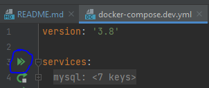
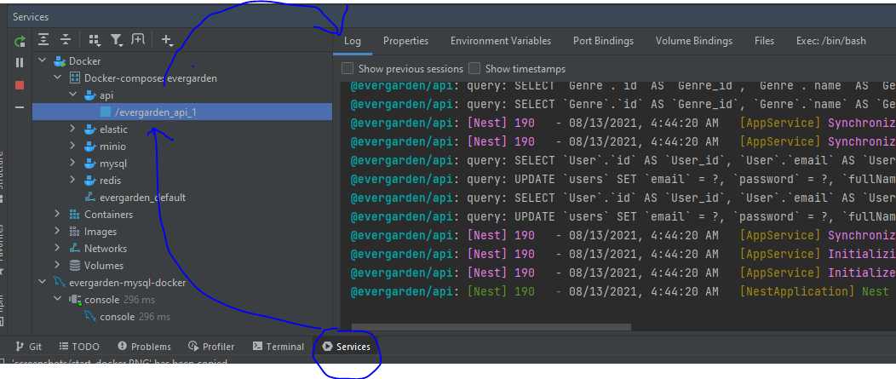
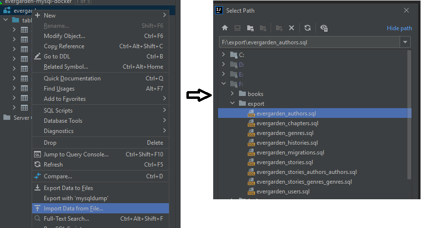

# evergarden
Reading and posting stories platform.

# Getting Started

## Prerequisite
1. [Nodejs](https://nodejs.org/en/) v14.17.3 or later
2. [Docker](https://www.docker.com/products/docker-desktop) v20.x.x or later

## Install
```bash
npm install
```

## Run

Please prepare an `.env` file in the root directory.
```bash
MINIO_ROOT_USER=<user>
MINIO_ROOT_PASSWORD=<password>
```

### Frontend

Prepare `.env.development` in `packages/webapp`
```bash
REACT_APP_GOOGLE_CLIENT_ID=<client-id>
REACT_APP_FACEBOOK_CLIENT_ID=<client-id>
```
Then
```bash
npm run start:webapp
```
You can see the webapp in [http://localhost:4000](http://localhost:4000)

### Backend
Prepare `.env.development` in `packages/api`
```bash
MYSQL_HOST=mysql
MYSQL_PORT=3306
MYSQL_USERNAME=root
MYSQL_PASSWORD=root
MYSQL_DBNAME=evergarden
REDIS_HOST=redis
REDIS_PORT=6379
ELASTIC_URL=http://elastic:9200
ELASTIC_USERNAME=elastic
ELASTIC_PASSWORD=changeme
GOOGLE_CLIENT_ID=<client-id>
GOOGLE_SECRET=<clent-secret>
MINIO_ROOT_USER=<user>
MINIO_ROOT_PASSWORD=<password>
```
Then
```bash
docker-compose -f .\docker-compose.dev.yml up
```
The recommended way is start backend services by UI, see the image below:



And show the backend log by this way.



> The APIs will be available in [http://localhost:3000](http://localhost:3000).
> The swagger docs will be in [http://localhost:3000/docs](http://localhost:3000/docs)

### Database

Use any tools to connect to the database by the following configuration:
- Host: localhost
- Port: 3306
- Username: root
- Password: root
- Database name: evergarden

There is a dump database in `dump` directory, please extract this dump file and import extracted files to the database.



## Development

### Project structure
```
.
├── dump                      # Dump database files
├── importdb                  # Import database from raw stories files utility
├── packages
│   ├── api                   # Backend api service
│   ├── shared                # Shared utilities and types between api and webapp
│   └── webapp                # Frontend
└── screenshots               # Images for docs
```

### Git
Your git commit message must follow the following rule:
```
commit-type: commit message

Ex: fix: cannot login with google account anymore
```
`commit-type` must be one of:
- **feat**: new feature for the user, not a new feature for build script
- **fix**: bug fix for the user, not a fix to a build script
- **docs**: changes to the documentation
- **style**: formatting, missing semi colons, etc; no production code change
- **refactor**: refactoring production code, eg. renaming a variable
- **test**: adding missing tests, refactoring tests; no production code change
- **build**: changes that affect the build system or external dependencies (example scopes: gulp, broccoli, npm)
- **ci**: changes to our CI configuration files and scripts (example scopes: Travis, Circle, BrowserStack, SauceLabs)
- **perf**: a code change that improves performance
- **chore**: if the above rules are not fit

### Database changes
If you changed an entity class (ex: add a new column, change max length),
before commit your changes you must generate the migration database.
```bash
cd cd .\packages\api
npm run typeorm:migrate
```
Your migration file will be generated in `.\packages\api\src\migrations` directory, please DO NOT CHANGE any files in this folder.
> Also commit migration files with your changed entity class.
